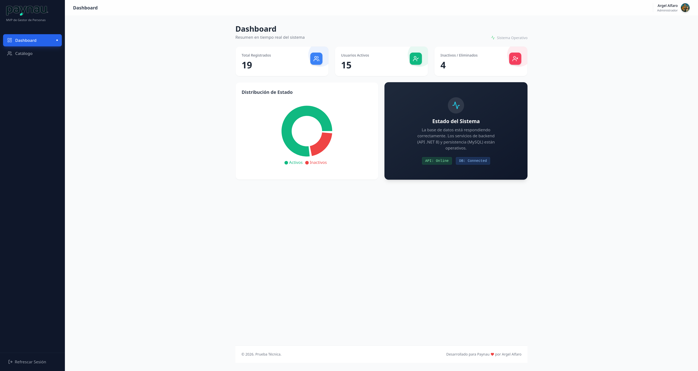
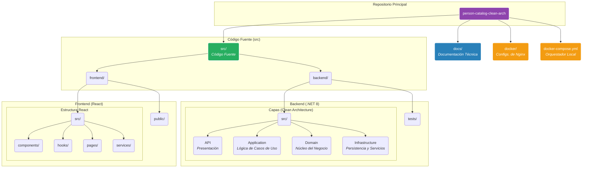

# 📘 PersonCatalog - Paynau Full-Stack Serverless Solution

**PersonCatalog** es una solución **Full Stack Cloud-Native** diseñada para demostrar la implementación de patrones de diseño avanzados en un entorno empresarial. El sistema gestiona un catálogo de personas con capacidades de auditoría completa, *soft-delete*, y análisis estadístico en tiempo real, todo orquestado bajo una **Clean Architecture** estricta.

## 📑 Centro de Documentación

La documentación técnica se ha modularizado para facilitar la navegación. Haz clic en cada módulo para profundizar:

| Módulo | Descripción | Enlace |
| :--- | :--- | :---: |
| **🏛️ Arquitectura** | Decisiones de diseño, Patrones (CQRS, Mediator) y Flujo de datos. | [Ver Documento](./docs/ARCHITECTURE.md) |
| **🛠️ Backend API** | Guía .NET 8, Clean Architecture, Endpoints y Swagger. | [Ver Documento](./docs/BACKEND.md) |
| **🎨 Frontend UI** | Arquitectura React 19, Hooks, TailwindCSS y Gráficos. | [Ver Documento](./docs/FRONTEND.md) |
| **☁️ Despliegue** | Guía paso a paso: Docker Local y AWS Serverless (Lambda/RDS). | [Ver Documento](./docs/DEPLOY.md) |

#### Si se desea correr el proyecto para testearlo, dirigete de inmediato a la sección de [**☁️ Despliegue**](./docs/DEPLOY.md). Ahí está detallado el proceso para levantarlo con docker-compose.

## 🚀 Stack Tecnológico

El proyecto utiliza tecnologías de vanguardia para asegurar escalabilidad, mantenibilidad y rendimiento.

| Área | Tecnología | Propósito y Detalles |
| :--- | :--- | :--- |
| **Backend** | .NET 8 / ASP.NET Core | Core de la API RESTful. |
| | Entity Framework Core | ORM para acceso a datos (Code-First) con MySQL 8.0. |
| | MediatR | Implementación de los patrones CQRS y Mediator. |
| | FluentValidation | Declaración de reglas de negocio robustas. |
| | xUnit + Moq | Frameworks para pruebas unitarias y de integración. |
| **Frontend**| React 19 (con Vite) | Librería de UI con TypeScript y compilación ultrarrápida. |
| | Hooks / Context API | Gestión de estado del servidor y estado global. |
| | TailwindCSS | Framework CSS Utility-First para diseño responsivo. |
| | Recharts | Creación de gráficos y visualizaciones para el dashboard. |
| | Axios | Cliente HTTP para la comunicación con el Backend. |
| | Vitest + RTL | Pruebas unitarias y de integración de componentes. |
| **Infraestructura & DevOps** | Docker / Docker Compose | Orquestación del entorno de desarrollo local. |
| | AWS Lambda + API Gateway | Despliegue serverless del Backend en producción. |
| | AWS Amplify Hosting | Hosting CI/CD para el Frontend. |
| | Amazon RDS for MySQL | Base de datos relacional gestionada en la nube. |

## 🏗 Arquitectura del Sistema

El sistema está diseñado siguiendo los principios de **Clean Architecture** para garantizar una separación clara de responsabilidades y la **Regla de Dependencia**, donde las dependencias solo apuntan hacia el núcleo del negocio.

El flujo general es el siguiente:
1.  El **Cliente (React)** realiza peticiones HTTP a un **API Gateway (Nginx)**.
2.  Nginx redirige la petición al **Backend (.NET 8 Web API)**.
3.  La API recibe la petición y la delega a la capa de **Aplicación** usando el patrón **Mediator (MediatR)** para procesar Comandos o Consultas (CQRS).
4.  La capa de Aplicación orquesta la lógica, utilizando entidades del **Dominio** y las interfaces de la capa de **Infraestructura**.
5.  La capa de Infraestructura implementa el acceso a la base de datos **MySQL** a través de Entity Framework Core.

Para una explicación visual y detallada de los patrones y diagramas, por favor consulta el documento de arquitectura: **[Ver Documento de Arquitectura](./docs/ARCHITECTURE.md)**.

## 📂 Estructura del Repositorio

La estructura es un monorepositorio y está diseñada para ser intuitiva y escalable, separando claramente las responsabilidades.

