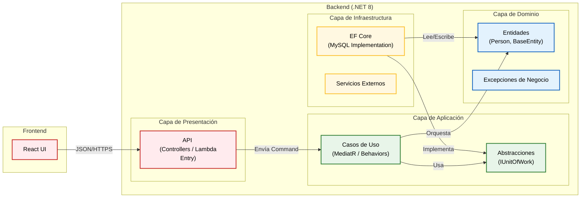
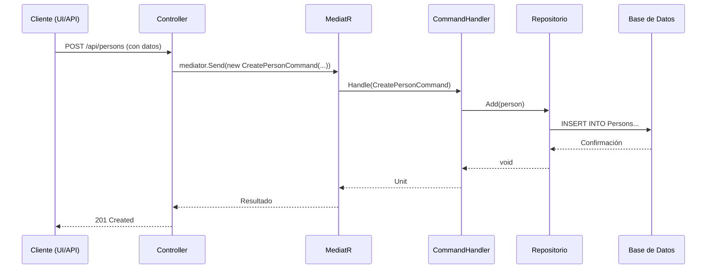
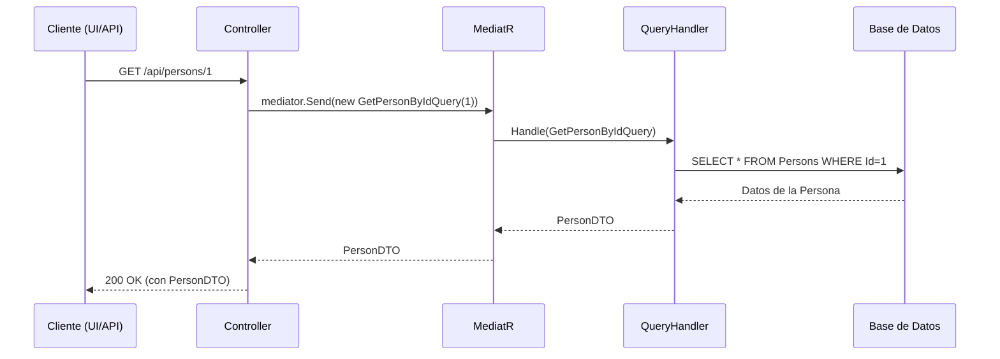

# 🏛️ Arquitectura del Sistema

Este documento detalla las decisiones arquitectónicas clave, los patrones de diseño y el flujo de datos que sustentan la solución en general.

## 1. Principios de Diseño

El sistema se fundamenta en tres pilares para esta prueba técnica:

- **Agnosticismo de Infraestructura**: El núcleo de negocio no sabe si corre en Docker, IIS o AWS Lambda.
- **Rendimiento en Lectura**: Separación de modelos de lectura y escritura para optimizar consultas complejas (Dashboard).
- **Integridad de Datos**: Mecanismos defensivos contra borrados accidentales y sobrescritura de datos concurrentes.

La arquitectura elegida es una implementación estricta de Clean Architecture combinada con **CQRS (Command Query Responsibility Segregation)**.

## 2. Clean Architecture (El Núcleo)

Seguimos estrictamente la Regla de Dependencia: *Las dependencias del código fuente solo pueden apuntar hacia adentro*. El dominio nunca depende de la base de datos o de la API.

### 2.1 Capas

- `Domain` (**El Corazón**):
    - Contiene la entidad `Person` y la clase base `BaseEntity`.
    - Aquí residen las reglas de negocio puras (ej. *un usuario no puede ser reactivado si ya está activo*).
    - **No tiene dependencias externas** (ni siquiera Entity Framework).
- `Application` (**La Orquestación**):
    - Define **QUÉ** hace el sistema (Crear Persona, Obtener Dashboard).
    - Utiliza `MediatR` para desacoplar la recepción de la petición de su procesamiento.
    - Implementa `FluentValidation` para validar los datos de entrada antes de que toquen el dominio.
- Infrastructure (**El Músculo**):
    - Define **CÓMO** se hacen las cosas.
    - Implementa el acceso a datos con `Entity Framework Core`.
    - Aquí se configuran los mapeos a la base de datos `MySQL` y la ejecución de `Stored Procedures`.
- API (**La Puerta de Entrada**):
    - Capa muy delgada. Su única función es recibir HTTP y transformar excepciones de dominio en códigos de estado HTTP (`400`, `404`, `500`) mediante un **Global Exception Handler**.
    - Preparada para funcionar como **AWS Lambda** gracias a la inyección de `AWSLambdaHosting`.

## 3. CQRS (Command Query Responsibility Segregation)

Para optimizar y clarificar los flujos de datos, separamos las operaciones de escritura (Comandos) de las de lectura (Consultas).

- **Comandos (Commands)**: Representan una intención de cambiar el estado del sistema (Crear, Actualizar, Eliminar). Son procesados por `CommandHandlers` que contienen la lógica de negocio, validaciones y la persistencia de los cambios. No devuelven datos, solo una confirmación (o un error).

- **Consultas (Queries)**: Representan una solicitud de datos. Son procesadas por `QueryHandlers` que acceden directamente a la base de datos (a menudo omitiendo el repositorio genérico para optimizar la lectura) y devuelven un **DTO (Data Transfer Object)** específico para la vista que lo necesita.

### 3.1 Flujo de un Comando

### 3.2 Flujo de una Consulta

##### Para consultas de alto rendimiento (como el Dashboard), se bypassa la lógica de EF Core y se ejecutan Stored Procedures directamente para obtener DTOs planos.

## 4. Patrones Tácticos de Persistencia

Esta arquitectura implementa soluciones específicas para problemas comunes en sistemas empresariales:

### 🛡️ 4.1 Soft Delete (Borrado Lógico)

En lugar de eliminar físicamente los registros (`DELETE`), el sistema implementa un patrón de **Soft Delete**.

- Las entidades implementan una interfaz ISoftDelete.
- Al "eliminar", simplemente se marca `IsActive` = `false` y se audita la fecha.
- **EF Core Query Filters**: Se configuró un filtro global en el `DbContext` para que todas las consultas (`SELECT`) ignoren automáticamente los registros eliminados, a menos que se solicite explícitamente (como en la reactivación).

### 🔒 4.2 Concurrencia Optimista

Para evitar el problema de "*la última escritura gana*" en entornos concurrentes:

- La entidad `Person` incluye un token de concurrencia (`RowVersion`).
- Si dos usuarios intentan editar el mismo registro al mismo tiempo, el segundo recibirá un error controlado (`DbUpdateConcurrencyException`), obligándole a refrescar los datos antes de guardar.

## 5. Monorepositorio y Estructura

El uso de un monorepositorio para albergar tanto el `frontend` como el `backend` ofrece varias ventajas en este contexto:

- **Visibilidad Completa**: Facilita la comprensión de todo el sistema en un solo lugar.
- **Atomicidad de Cambios**: Un cambio que afecta tanto al frontend como al backend (por ejemplo, un nuevo endpoint y su consumo) puede realizarse en un único commit y PR.
- **Gestión Simplificada**: Una única pipeline de CI/CD, un solo sistema de versionado y una gestión de issues centralizada.