# 🚀 Guía de Despliegue (Local y AWS Serverless)

Este documento detalla los pasos exactos para desplegar (Backend-Frontend) tanto en entorno local (Docker) como en cloud (AWS Serverless).

1.  **Entorno de Desarrollo Local**: Utilizando Docker Compose para levantar todo el stack de manera rápida y consistente.
2.  **Entorno de Producción en AWS**: Desplegando la solución bajo una arquitectura serverless de alta disponibilidad con AWS Lambda, API Gateway, RDS y Amplify.

## 1. 🐳 Entorno Local (Docker Compose)

Esta es la forma más rápida de probar la aplicación completa sin instalar dependencias de .NET o Node.js en nuestro local.

#### Comandos de Gestión

### 1.1. Iniciar todo el sistema: Construye las imágenes y levanta los contenedores en segundo plano.

```bash
docker-compose up --build -d
```

#### Acceso:
- Frontend: http://localhost:3000
- API Swagger: http://localhost:5268/swagger
- Base de Datos: Puerto 3306

### 1.2. Ver logs en tiempo real: Si necesitas depurar un contenedor específico (ej. `persona-api`).

```bash
docker-compose logs -f persona-api
```

### 1.3. Limpieza Total (Reset). 

Este comando detiene los contenedores y elimina los volúmenes, borrando la base de datos para empezar desde cero.

```bash
docker-compose down -v
```

## 2. ☁️ Despliegue en la nube (AWS Serverless)

Implementamos una arquitectura Cost-Effective utilizando AWS Free Tier.

#### 🏗️ Arquitectura

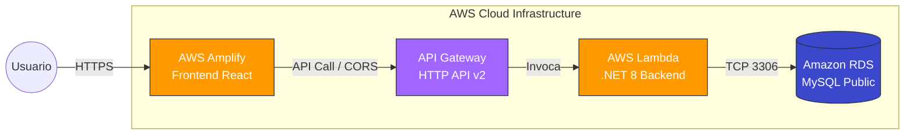

### PASO 1: Base de Datos (Amazon RDS)

Configuramos una instancia MySQL accesible públicamente para permitir la conexión desde Lambda (sin VPC compleja en este caso para ahorrar costos) y herramientas locales.

- Servicio: RDS -> Crear base de datos -> MySQL (Free Tier).
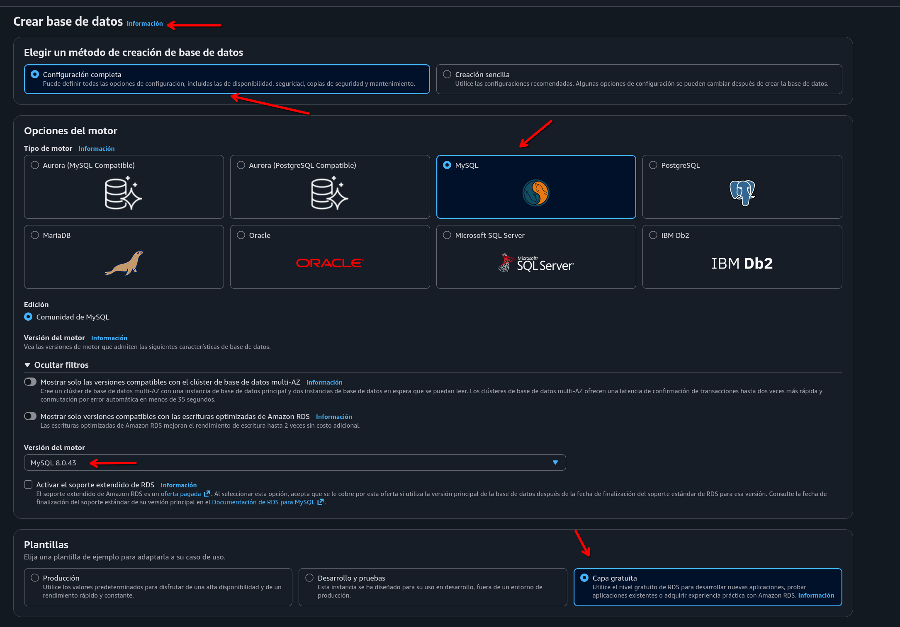
- Configuración Clave:
    - Autenticación: Contraseña Maestra (Guardar para después).
    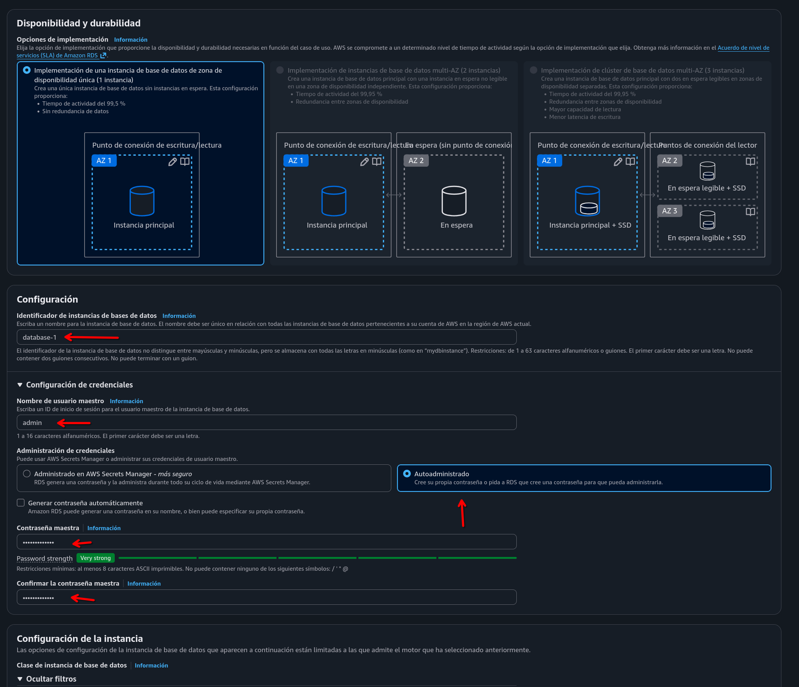
    - Acceso Público: Sí (Publicly Accessible).    
    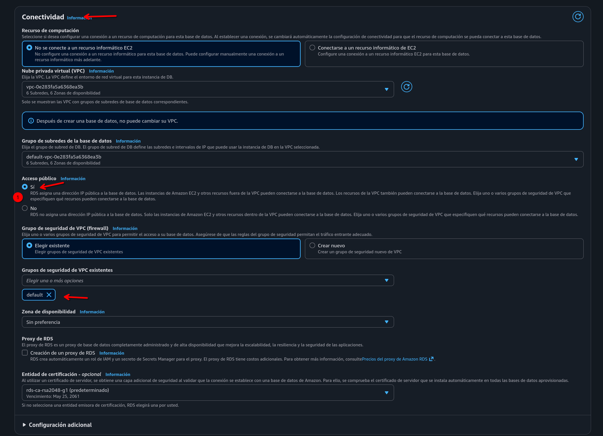

- Firewall (Security Groups):
    - Una vez creada, ir a Connectivity & security -> Security groups.
    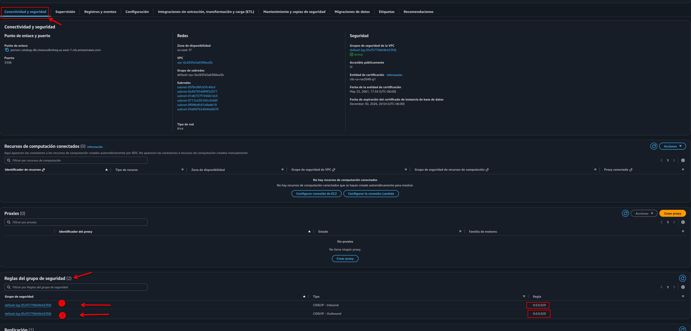
    - Editar Inbound rules (Reglas de entrada).
    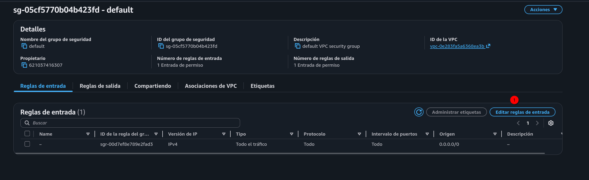
    - Agregar regla: Type: MySQL (3306), Source: Anywhere-IPv4 (0.0.0.0/0).
    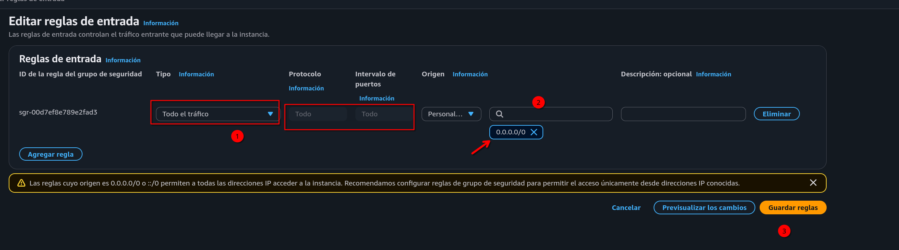

##### Referencia: Habilitar tráfico 0.0.0.0/0 es necesario para este esquema sin NAT Gateway.

### PASO 2: Backend (.NET 8 en Lambda)

Para fines prácticos, detallaremos a continuación el deploy de los binarios compilados directamente a la `Lambda` que crearemos.

#### 2.1. Preparar el Código

En `Program.cs`, ya contamos con la integración para Lambda (AWS) y el fix de Swagger para reconocer luego la ruta `$default` en nuestro `Gateway` que será configurado:

```bash
builder.Services.AddAWSLambdaHosting(LambdaEventSource.HttpApi);
// ...
app.UseSwaggerUI(c => {
    c.SwaggerEndpoint("v1/swagger.json", "API v1");
    c.RoutePrefix = "swagger"; 
});
```

#### 2.2. Compilar y Empaquetar

##### Ejecutar desde la raíz del proyecto:

```bash
dotnet publish src/backend/PersonCatalog.Api/PersonCatalog.Api.csproj -c Release -r linux-x64 --self-contained false -o ./lambda_publish
```

###### NOTA: También es posible realizar la publicación directamente desde el IDE que estemos utilizando.

- Acción: Ir a la carpeta `lambda_publish` que se creó en el espacio del directorio que ejecutamos `/`, seleccionar todos los archivos dentro y comprimirlos en un archivo que podremos llamar `deploy.zip`.

#### 2.3. Configurar Lambda

- Crear función: Author from scratch, Runtime .NET 8, Arq. x86_64.
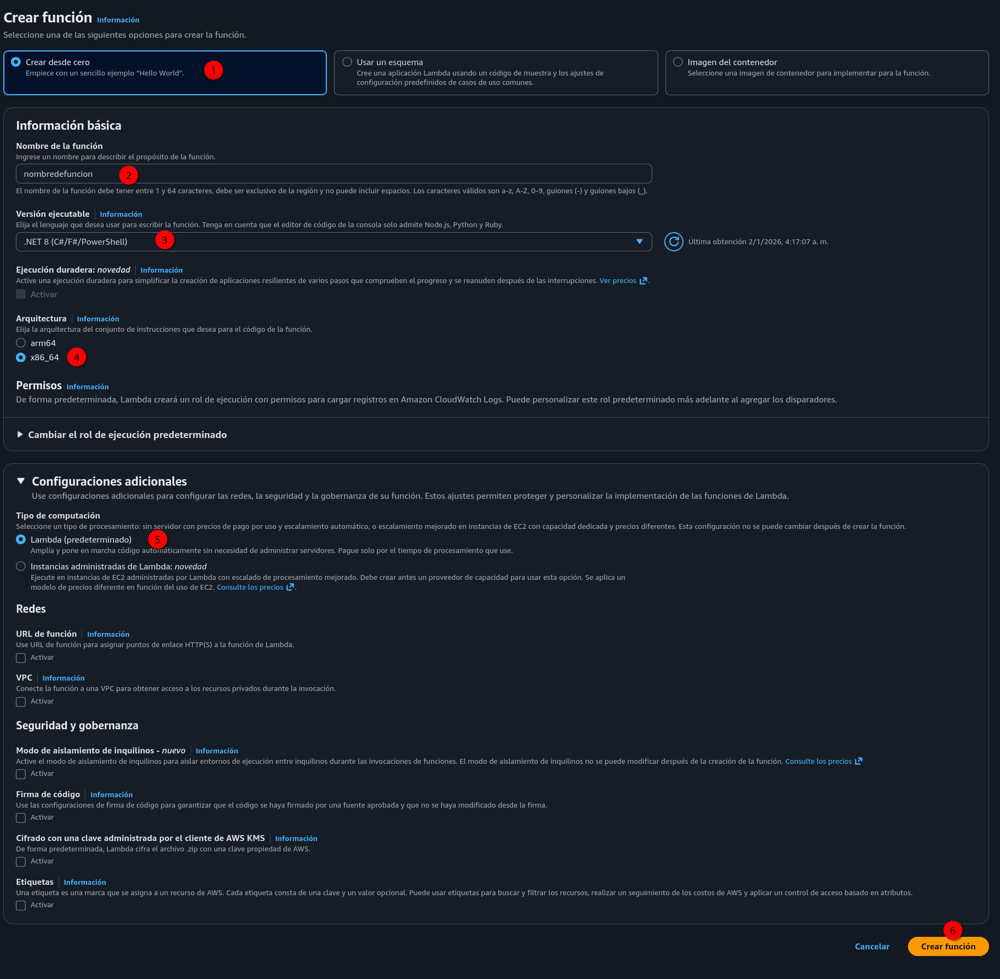
- Subir código: Upload from .zip file -> Cargar deploy.zip.
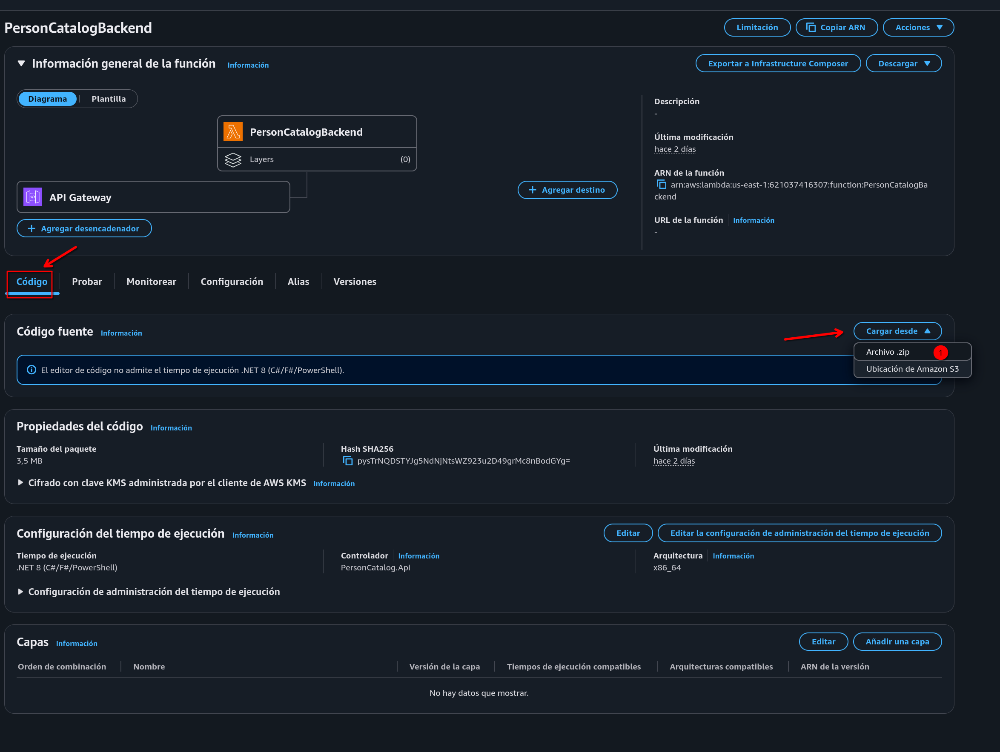
- Runtime Settings (Handler):
    - Cambiar a: PersonCatalog.Api (Nombre del ensamblado sin .dll).
    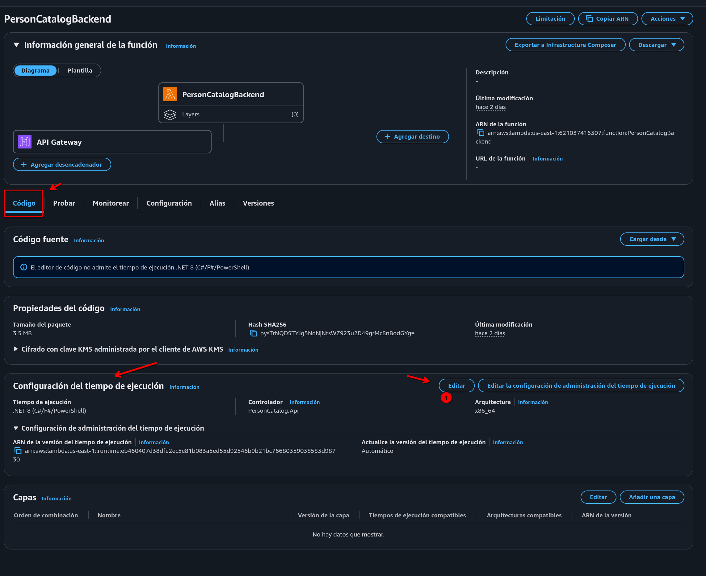
    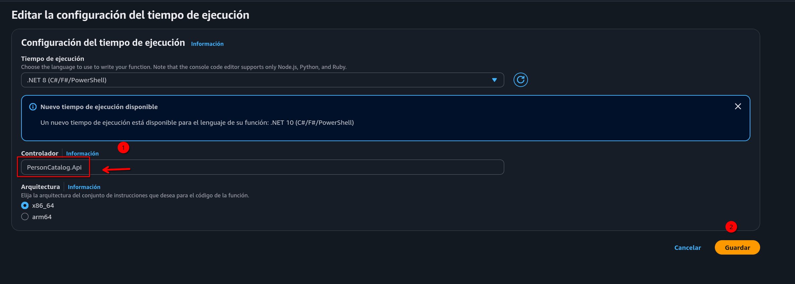
- Variables de Entorno:
    - `ConnectionStrings__DefaultConnection`: `<La cadena de conexión nuestro RDS o cualquier otro url hacía la base de datos>`.
    - `AllowedOrigins`: `*` (La URL de Amplify ó cualquiera que sea la URL de nuestro portal).
    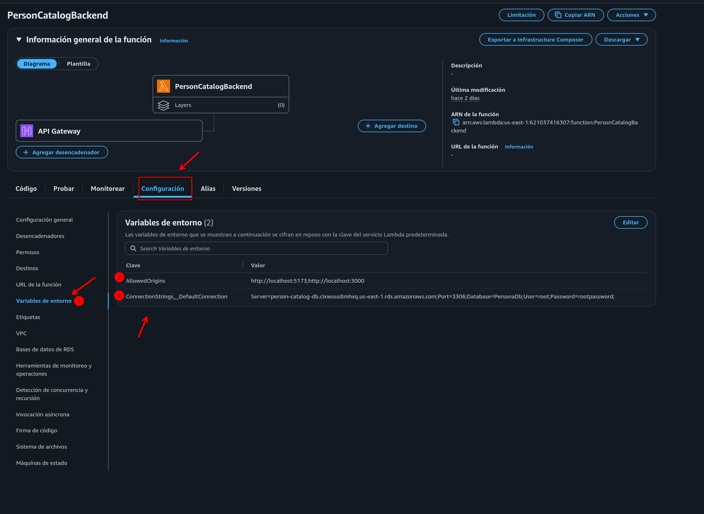

### PASO 3: API Gateway (Networking)

Exponemos la Lambda a internet:

- En la Lambda, clic en Add Trigger -> API Gateway.
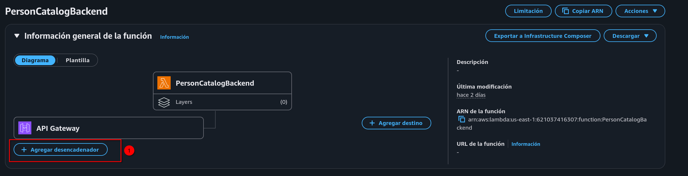
- Tipo: HTTP API, Seguridad: Open.
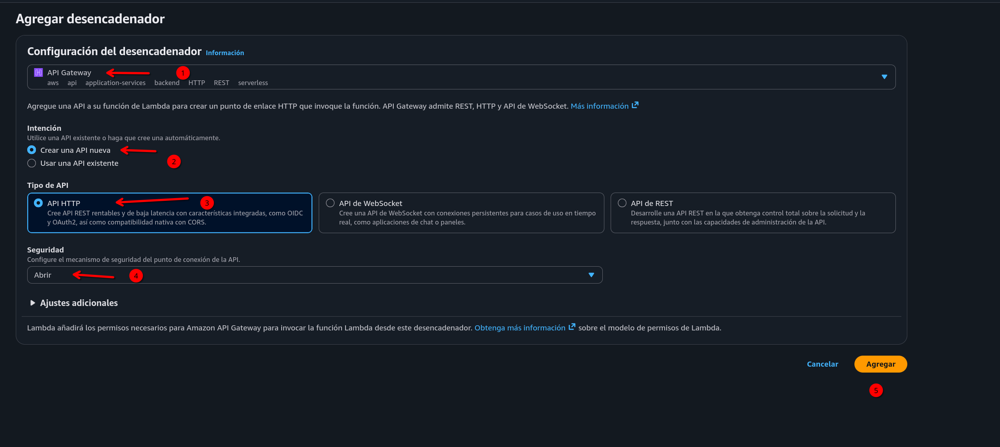
- Configuración de Rutas (Crucial):
    - Ir a la consola de API Gateway -> Routes.
    - Borrar cualquier ruta específica (ej. `/PersonCatalogBackend`) ya que en ocasiones es necesario porque AWS no reconoce bien la ruta.
    - Crear una ruta única: llamarla `$default` (Esto permite pasar /swagger, /api, etc.).
    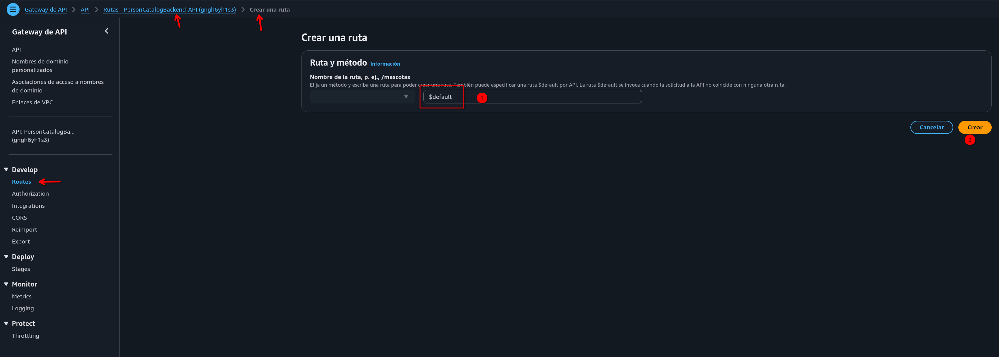
    - Asociar la integración con la Lambda y asegurar Payload Format Version 2.0.
    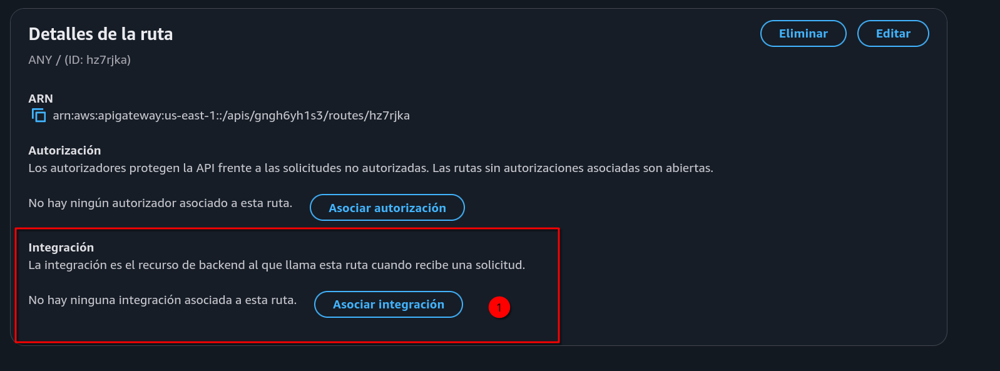
    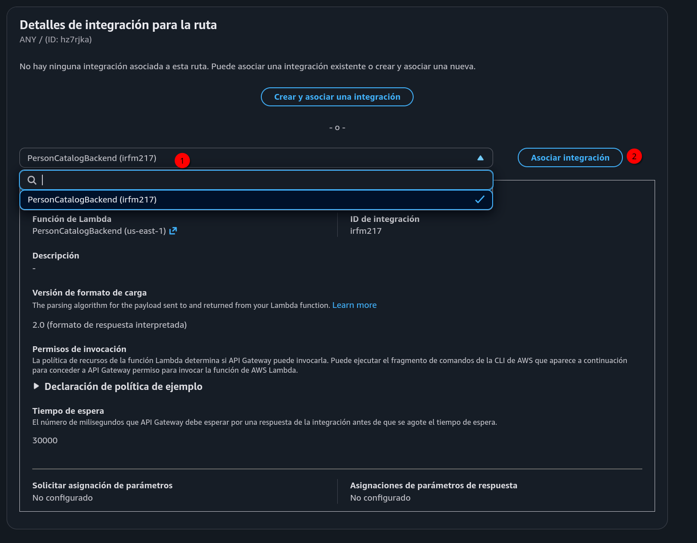
- CORS (Global):
    - Menú CORS.
    - Access-Control-Allow-Origin: * (Agregar y Guardar).
    - Access-Control-Allow-Methods: *.
    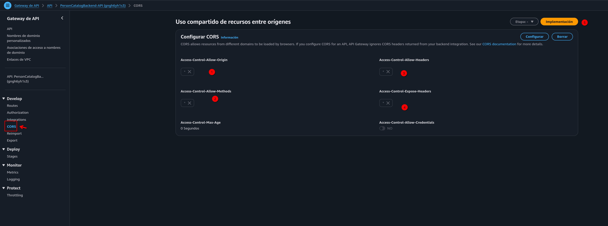

### PASO 4: Frontend (AWS Amplify)

Desplegaremos la UI compilada manualmente.

#### 4.1. Compilación Local

- Crear y/o editar el archivo `.env` ubicado en `src/frontend/.env`:

    ```bash
    VITE_API_URL=<https://URL_API_GATEWAY.amazonaws.com/default>
    ```

- Compilar:

    ```Bash
    npm run build
    ```

- Empaquetar: Entrar a la carpeta que se generó `/dist`, seleccionar todo el contenido y comprimir a un archivo `frontend-deploy.zip`.

#### 4.2. Subida a Amplify

- Consola AWS Amplify -> Create new app.
- Opción: Deploy without Git provider.
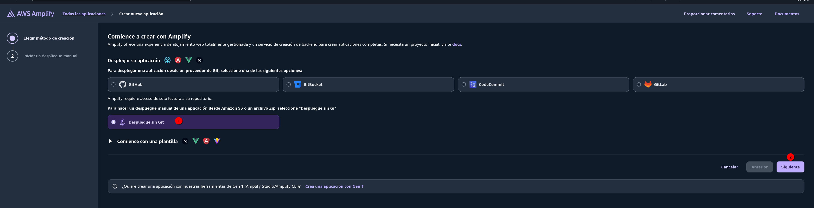
- Arrastrar el archivo `frontend-deploy.zip`.
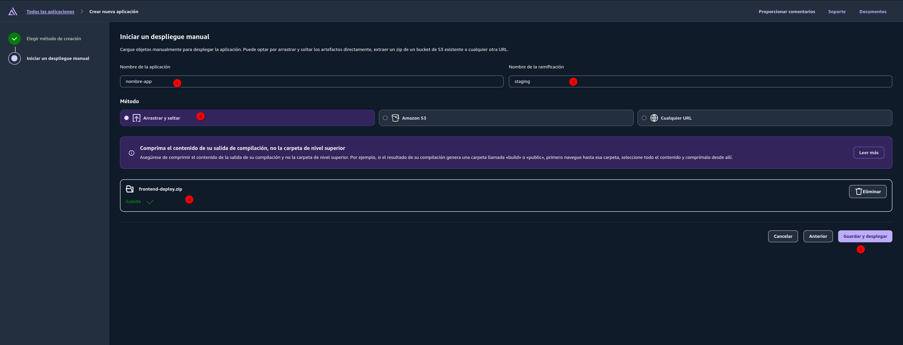
- Desplegar.

##### Resultado: Amplify proporcionará una URL pública (SSL incluido) donde la aplicación estará 100% operativa.